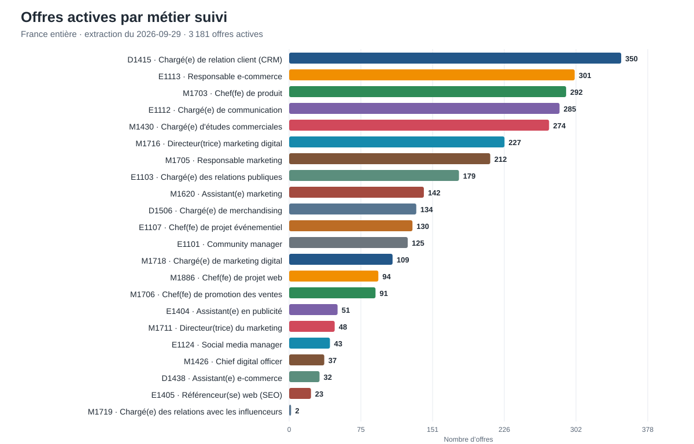
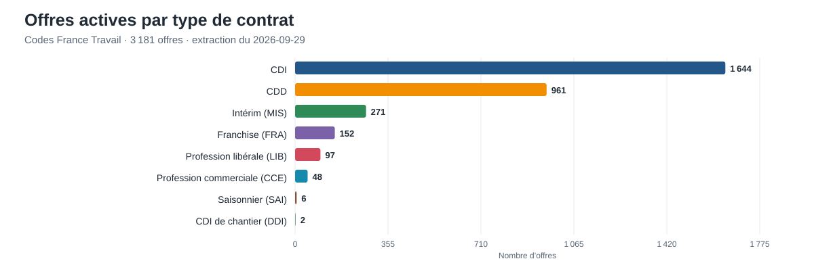
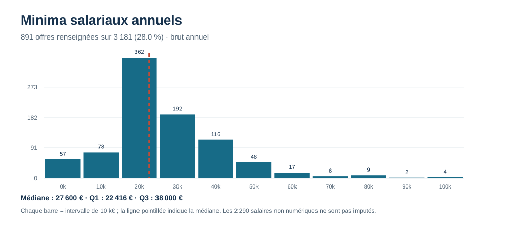
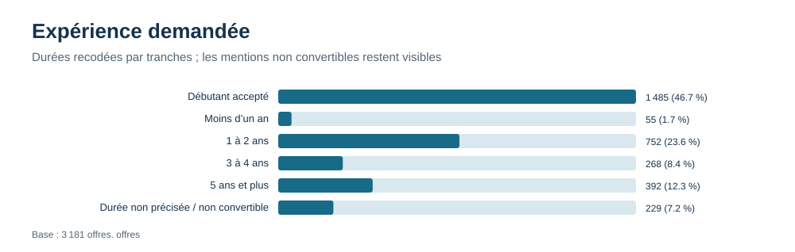
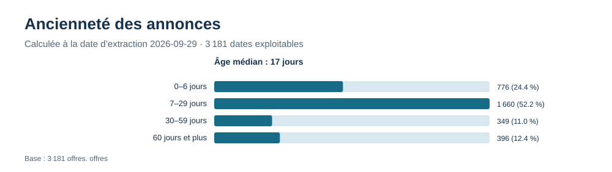
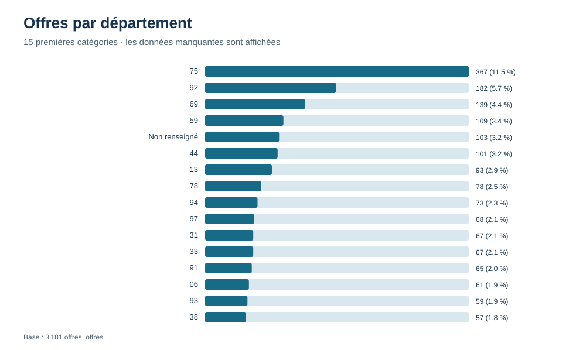
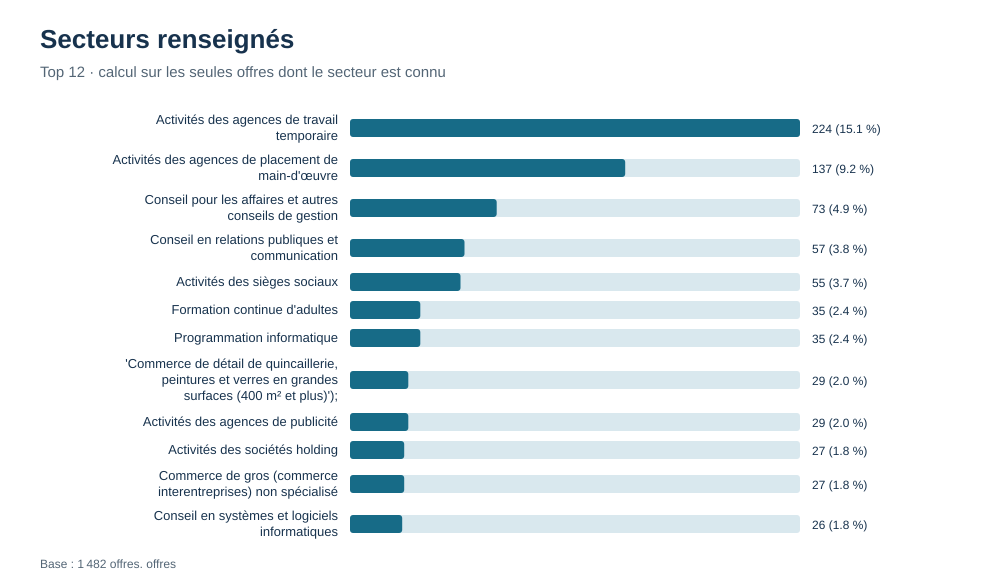
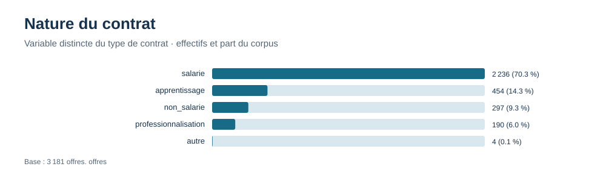

# Première exploration descriptive — offres des métiers du marketing

**Source et date :** `data/resume.json`, extraction du **29 septembre 2026**. Le corpus comprend **3 181 offres actives** pour 23 métiers ROME suivis (22 avec au moins une offre). Les graphiques sont des SVG générés par `scripts/generer_td1.py`.

**Unité statistique :** une offre active. Le nombre de postes peut être supérieur au nombre d’offres. Les données brutes ne sont ni supprimées ni imputées. Le dictionnaire des variables et les définitions se trouvent dans [`dictionnaire_variables.md`](dictionnaire_variables.md).

## Cinq graphiques principaux

### 1. Offres actives par métier

**Chiffre clé :** D1415, Chargé(e) de relation client (CRM), représente **350 offres, soit 11,0 %** du corpus. Les trois premiers métiers en représentent 943 (29,6 %).

Cette distribution décrit uniquement les métiers ROME suivis par le projet, pas l’ensemble des emplois du marché.

### 2. Familles de contrat

**Chiffre clé :** le CDI est la famille la plus fréquente avec **1 636 offres (51,4 %)** ; l’alternance en représente **644 (20,2 %)**.

Les familles sont exclusives selon la règle du site : l’alternance est comptée à part même si le code de contrat source est CDI ou CDD. Ce graphique ne doit donc pas être lu comme un décompte brut des codes API.

### 3. Minima salariaux annualisés

**Chiffre clé :** la médiane de `smin` est de **27 600 € brut/an**, parmi **891 offres (28,0 %)** ayant une borne annuelle numérique exploitable ; Q1 vaut 22 416 € et Q3 38 000 €.

L’histogramme présente le minimum salarial transformé, par tranches de 10 000 €. Il ne représente ni le salaire moyen ni une rémunération effectivement versée. Les valeurs extrêmes sont conservées et doivent être contrôlées dans le libellé source avant toute correction.

### 4. Expérience demandée

**Chiffre clé :** **1 485 offres (46,7 %)** sont classées « débutant accepté » selon la règle du projet (`exp_exige = D` ou `exp_ans = 0`).

Les durées converties sont regroupées en classes ordonnées. Les mentions sans durée convertible restent visibles à part ; cette variable est en partie recodée et son résultat dépend de la règle utilisée.

### 5. Ancienneté des annonces

**Chiffre clé :** l’âge médian est de **17 jours** à la date d’extraction ; **396 annonces** ont au moins 60 jours.

L’âge est calculé entre la date de création (`date`) et le 29 septembre 2026. Les classes visibles sont 0–6, 7–29, 30–59 et 60 jours ou plus ; la dernière barre donne directement les 396 annonces d’au moins 60 jours. Une annonce ancienne dans cette extraction n’est pas nécessairement encore ouverte : ce chiffre décrit l’ancienneté des annonces observées, pas leur disponibilité vérifiée.

## Graphiques complémentaires

Ces vues sont utiles pour explorer les données, mais leur couverture ou leur portée demande une précaution supplémentaire.

### Localisation par département

Le département le plus représenté est **75 avec 367 offres**. Le département est manquant pour **103 offres (3,2 %)**. La carte du site combine des positions d’offre et des positions estimées à la commune ou au département : la précision doit être lue avec `prec`.

### Secteurs d’activité renseignés

Parmi les **1 482 secteurs connus (46,6 % du corpus)**, les agences de travail temporaire sont les plus fréquentes (**224 offres**). Cette répartition ne peut pas être extrapolée aux annonces sans secteur renseigné.

### Nature du contrat

La catégorie « salarié » concerne **2 236 offres**. Cette variable décrit une nature d’activité et n’est pas équivalente au code de contrat ni aux familles exclusives du graphique principal.

## Données manquantes et qualité

| Champ | Manquants / vides | Part du corpus |
|---|---:|---:|
| Employeur | 880 | 27,7 % |
| Département et coordonnées | 103 | 3,2 % |
| Libellé de salaire | 2 248 | 70,7 % |
| Minimum/maximum salarial numérique | 2 290 | 72,0 % |
| Durée d’expérience numérique | 229 | 7,2 % |
| Qualification | 1 878 | 59,0 % |
| Formation | 2 925 | 92,0 % |
| Secteur | 1 699 | 53,4 % |
| Temps plein/partiel | 2 417 | 76,0 % |
| Outils / compétences | liste vide pour 1 540 / 2 433 offres | 48,4 % / 76,5 % |

Il y a **42 offres avec un libellé salarial mais sans minimum numérique annualisé** : ce sont des échecs ou cas non pris en charge par le parseur, à revoir à partir des libellés avant d’étendre les calculs. Une liste `outils` vide signifie qu’aucun mot de la grille de détection n’a été trouvé ; une liste `competences` vide signifie que la source n’en fournit pas dans le résumé.

L’examen des quartiles repère 28 minima et 30 maxima salariaux au-delà de la borne supérieure usuelle à 1,5 écart interquartile. Ce seuil signale des observations à vérifier, pas des erreurs automatiques : aucune n’est supprimée. Les combinaisons répétées d’intitulé, employeur et lieu ne sont pas dédupliquées, car des annonces distinctes peuvent partager ces champs. Les contrôles n’ont pas trouvé d’identifiants répétés dans le résumé ni de minimum supérieur au maximum.

## Méthode et limites

- Les catégories nominales sont décrites par des effectifs et parts ; les durées et formations sont ordonnées lorsque leur recodage le permet. Les salaires sont décrits par médiane et quartiles, plus un histogramme.
- Les pourcentages des graphiques principaux utilisent les 3 181 offres comme dénominateur. Pour le secteur, le dénominateur est celui des seuls secteurs connus ; les effectifs manquants sont donnés explicitement.
- `smin` et `smax` sont extraits et annualisés par `scripts/resumer.py` à partir d’un texte, donc restent des variables dérivées. `niveau`, `nature`, `formation`, `exp_ans`, `outils` et les familles contractuelles impliquent également des règles de recodage ou de détection.
- Les données viennent d’offres publiées sur France Travail et de la sélection ROME du dépôt ; elles ne représentent pas exhaustivement le marché du travail. La série temporelle ne comporte que huit extractions.
